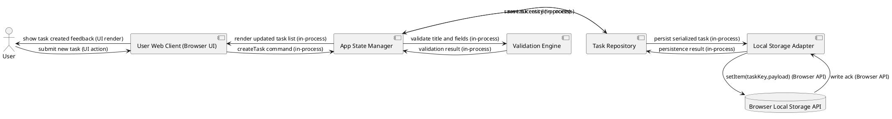
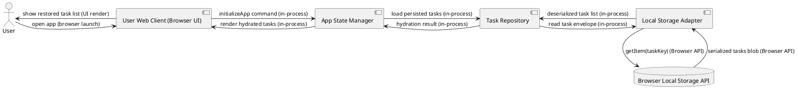
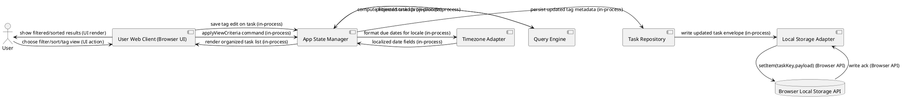

```plantuml
@startuml
actor "User" as U
component "User Web Client (Browser UI)" as UI
component "App State Manager" as ASM
component "Consent Manager" as CM
component "Task Repository" as TR
component "Local Storage Adapter" as LSA
database "Browser Local Storage API" as LS

U -> UI : open app first time (browser launch)
UI -> ASM : initialize consent check (in-process)
ASM -> CM : evaluate consent status (in-process)
CM -> TR : read consent record (in-process)
TR -> LSA : fetch consent envelope (in-process)
LSA -> LS : getItem(consentKey) (Browser API)
LS --> LSA : consent payload or null (Browser API)
LSA -> TR : consent data result (in-process)
TR -> CM : consent state (in-process)
CM -> ASM : require notice display (in-process)
ASM -> UI : render privacy notice modal (in-process)
U -> UI : acknowledge notice (UI action)
UI -> ASM : submit consent acknowledgment (in-process)
ASM -> CM : record consent(version,timestamp) (in-process)
CM -> TR : persist consent record (in-process)
TR -> LSA : write consent envelope (in-process)
LSA -> LS : setItem(consentKey,payload) (Browser API)
LS --> LSA : write ack (Browser API)
@enduml
```

## Section 1: About the System

- This system is a web-based personal todo application that allows individual consumers to create, update, complete, delete, and organize tasks directly in their browser.
- The primary users are single-user consumers (no shared/team workflows) who need lightweight productivity support with minimal setup overhead.
- Core traits include low-latency UI interactions, privacy-by-design for Release 1 (no remote task content transfer), resilience to browser refresh/restart, and accessibility-oriented UX.
- The system is **stateful at the client layer** (browser local storage) and intentionally **backend-light** for core task operations.
- **System Classification:** **CRUD / Data Management** — the primary value is storing, retrieving, and manipulating task records.

## Section 2: Requirements & Goals

| REQ-ID | Functional Area | Operations Included | Source (BRD section) | Covered | HLD Section | Notes |
|--------|-----------------|---------------------|----------------------|---------|-------------|-------|
| REQ-001 | Task Lifecycle Management | Create, list, edit, delete, complete, reactivate | §6 FR-001/003/004/005/006, §8 US-001..US-005, §9 BR-001/002/003 | Yes | Section 5.1 | Covers: add, view, edit, delete (with confirmation), status toggle active↔completed |
| REQ-002 | Local Persistence & Data Recovery | Persist task data locally, reload on app relaunch/refresh, local-only behavior | §6 FR-007/011, §8 US-006/US-010, §9 BR-005 | Yes | Section 5.2 | Covers: write-through local storage persistence, startup hydration, no remote task export |
| REQ-003 | Task Organization (Filter/Sort/Tag/Time Rendering) | Filter by status/tag, sort by due date/priority, tag assign/edit, UTC storage/local rendering | §6 FR-008/009/010, §8 US-007/US-008/US-009 | Yes | Section 5.3 | Covers: status filter, tag filter, sort options, tag normalization, UTC internal date handling |
| REQ-004 | Privacy Notice & Consent Record | Display privacy notice, store notice/consent version at first use | §7 NFR-COMP-1/2, §8 US-010, §7 NFR-PRIV-2 | Yes | Section 5.4 | Covers: first-run disclosure, local-only warning, consent/version metadata persistence |
| REQ-005 | Accessibility & Frontend Quality Controls | WCAG 2.1 AA support, validation behavior, dependency/vuln quality gate, testability requirements | §7 NFR-UX-3, NFR-SEC-2/4, NFR-MAIN-1/2 | No | N/A | Non-functional engineering quality area; requires implementation/test plan and tooling decisions in LLD + QA strategy |

### Uncovered Requirements

- **REQ-005 — Accessibility & Frontend Quality Controls**
  - **Reason:** This is largely a cross-cutting non-functional quality envelope rather than a single runtime feature flow. It is not blocked, but detailed control implementation (lint rules, test harness composition, accessibility test matrix, SAST/dep scan pipeline specifics) belongs to LLD and QA/Test architecture.
  - **Trigger to include in architecture expansion:** If stakeholders request a dedicated quality platform design (e.g., CI/CD architecture with gates, accessibility automation service, policy-as-code enforcement) then this will become a covered architecture requirement.

> Coverage check: 4/5 requirements covered = 80% (meets minimum threshold).

## Section 3: Capacity Estimations & Constraints

All values marked `[ASSUMED]` are inferred where BRD is silent.

| Metric | Assumption / Formula | Result |
|---|---|---|
| MAU | BRD KPI target by month 6 | 5,000 users/month |
| WAU | 40% of MAU target | 2,000 users/week |
| DAU | `[ASSUMED]` 35% of WAU active daily = 0.35 × 2,000 | **700 DAU** |
| Avg tasks/day/user (writes) | `[ASSUMED]` 6 write actions/day (create/edit/toggle/delete/tag updates) | 6 |
| Daily write ops | 700 × 6 | **4,200 writes/day** |
| Write RPS average | 4,200 / 86,400 | **0.049 RPS** |
| Peak multiplier | `[ASSUMED]` 6× during morning/evening planning windows | 6× |
| Peak write RPS | 0.049 × 6 | **0.294 RPS** |
| Avg reads/day/user | `[ASSUMED]` 25 read/view/filter/sort actions/day | 25 |
| Daily read ops | 700 × 25 | **17,500 reads/day** |
| Read RPS average | 17,500 / 86,400 | **0.203 RPS** |
| Peak read RPS | 0.203 × 6 | **1.218 RPS** |
| Avg task payload size | `[ASSUMED]` 0.8 KB/task serialized JSON incl metadata | 0.8 KB |
| New tasks/day/user | `[ASSUMED]` 2 tasks/day | 2 |
| Daily new tasks | 700 × 2 | **1,400 tasks/day** |
| Data volume/day (new data) | 1,400 × 0.8 KB | **1.12 MB/day** |
| 1-year raw growth | 1.12 MB × 365 | **~409 MB/year** |
| 5-year raw growth | 409 MB × 5 | **~2.0 GB/5 years** |
| Effective retained/server-side | No remote task storage in R1 (FR-011) | **0 task-content bytes server-retained** |
| Telemetry volume/day | `[ASSUMED]` 20 events/DAU × 700 × 0.5 KB | **~7 MB/day** (if enabled) |
| Inbound bandwidth (hosting) | `[ASSUMED]` 1.2 page loads/DAU/day × 700 × 350 KB gz bundle | **~294 MB/day inbound from CDN origin equivalent** |
| Outbound bandwidth to clients | Same as above (static assets download) | **~294 MB/day outbound** |
| Retention policy (task data) | BRD NFR-PRIV-1 | Persist in browser until user deletes task or clears browser data |
| Retention policy (consent logs) | `[ASSUMED]` if local-only, stored in local storage for app lifetime | Local until browser data clear |
| Retention policy (operational logs) | `[ASSUMED]` 30 days hot + 180 days archive for non-PII operational telemetry | 210-day total |

**Constraints impacting architecture:**
- No remote task content transfer (FR-011, BR-005).
- Web-only and no auth in Release 1.
- Reliability target 99.5% uptime depends mainly on static hosting + client robustness.
- Browser storage quotas constrain per-device data growth; design must degrade gracefully near quota.

## Section 4: High-Level Architecture

### Architecture Style

**Chosen style:** **Modular Monolith (Frontend SPA) + Browser Storage Adapter Layer**.

This system is a single deployable web application with strict internal modular boundaries (Task Domain, Persistence Adapter, Query/Projection Engine, Privacy/Consent Module, UI). This is appropriate because Release 1 has no distributed backend domain services, low throughput requirements, and strong requirement for rapid iteration with minimal operational overhead.

**Alternative considered:** microservices with backend APIs. Rejected because it violates FR-011 local-only privacy posture for task content, adds unnecessary ops complexity, and provides no proportional value at current scale.

### Core Services / Components

**User Web Client (Browser UI)**
- Responsibility: Render screens, collect user actions, show feedback/errors.
- Does not do: direct schema mutation without going through App State Manager.
- Data owned: Ephemeral UI state only.
- Interfaces: Browser DOM events, HTTPS static asset fetch.
- Dependencies: App State Manager.

**App State Manager**
- Responsibility: Orchestrate task commands (create/edit/delete/toggle), validation, optimistic UI updates, and query/filter/sort projections.
- Does not do: direct persistence API access by UI bypass.
- Data owned: In-memory normalized task state.
- Interfaces: In-process function/API boundary.
- Dependencies: Validation Engine, Task Repository, Query Engine, Timezone Adapter, Consent Manager.

**Validation Engine**
- Responsibility: Enforce business rules (mandatory title, sanitize text, deletion confirmation prerequisites).
- Does not do: storage I/O.
- Data owned: Validation rules configuration.
- Interfaces: In-process.
- Dependencies: none.

**Task Repository**
- Responsibility: Abstract read/write persistence contract for tasks and metadata.
- Does not do: presentation-level ordering logic.
- Data owned: Persistence mapping logic.
- Interfaces: In-process repository methods.
- Dependencies: Local Storage Adapter.

**Local Storage Adapter**
- Responsibility: Physical persistence to Browser Local Storage API; serialization/deserialization and corruption handling.
- Does not do: business logic decisions.
- Data owned: localStorage keys and versioned envelope format.
- Interfaces: Browser Local Storage API.
- Dependencies: Browser Local Storage API.

**Query Engine**
- Responsibility: Filter/sort/tag projections over in-memory tasks.
- Does not do: mutate persisted state except view preferences `[ASSUMED]`.
- Data owned: Query strategy and comparator policies.
- Interfaces: In-process.
- Dependencies: App State Manager data snapshots.

**Timezone Adapter**
- Responsibility: Store timestamps in UTC and render due date/time in local timezone.
- Does not do: business rule validation unrelated to time.
- Data owned: date conversion utilities.
- Interfaces: In-process.
- Dependencies: Browser Intl/Date APIs.

**Consent Manager**
- Responsibility: Show first-run privacy notice; record displayed notice version and acknowledgment.
- Does not do: external legal record submission in R1.
- Data owned: consent metadata records in local storage.
- Interfaces: In-process.
- Dependencies: Task Repository/Local Storage Adapter.

**Browser Local Storage API (External Dependency)**
- Responsibility: Key-value persistence on local device.
- Data owned: persisted task/consent JSON blobs.
- Interfaces: browser API.
- Dependencies: browser runtime.

**Static Hosting + CDN**
- Responsibility: Serve SPA assets over HTTPS.
- Does not do: task data processing.
- Data owned: build artifacts.
- Interfaces: HTTPS.
- Dependencies: DNS/TLS/CDN provider.

### Communication Pattern Design

| Interaction | Pattern | Protocol | Justification |
|-------------|---------|----------|---------------|
| User Web Client → App State Manager | Sync | In-process event call | Immediate UI response required for interaction feedback. |
| App State Manager → Validation Engine | Sync | In-process | Command must be validated before state mutation. |
| App State Manager → Task Repository (write path) | Sync | In-process | User expects immediate success/failure on save actions. |
| Task Repository → Local Storage Adapter | Sync | In-process | Local browser API call is local and low latency; needed for durability before confirmation. |
| Local Storage Adapter → Browser Local Storage API | Sync | Browser API | Native API is synchronous; architecture wraps with error boundary. |
| App State Manager → Query Engine | Sync | In-process | Filter/sort results needed immediately for screen rendering. |
| App State Manager → Timezone Adapter | Sync | In-process | Date rendering is required inline for display. |
| App State Manager → Consent Manager | Sync | In-process | First-run gate must complete before full app usage. |
| Static Hosting/CDN → User Web Client | Sync | HTTPS GET | Browser fetches static assets directly. |
| App State Manager → Telemetry Sink `[ASSUMED optional]` | Async | `navigator.sendBeacon` / HTTPS | Non-blocking analytics to avoid UX latency; no task content in payload. |

## Section 5: Per-Requirement Design

### Requirement: REQ-001 — Task Lifecycle Management

#### 1. Overview
This requirement is fulfilled by routing all task lifecycle commands through App State Manager, which enforces validation and persists confirmed changes through Task Repository into local storage. The representative flow shown is **Create Task**; edit/delete/toggle follow the same component chain with operation-specific validation branches.

#### 2. Components Involved
- User (actor)
- User Web Client (Browser UI)
- App State Manager
- Validation Engine
- Task Repository
- Local Storage Adapter
- Browser Local Storage API

#### 3. Feature Component Diagram

#### 4. User Flow
1. User enters task title and optional fields from the main screen.
2. User clicks save/create.
3. User sees immediate feedback: task appears in active list on success, or inline validation error if title is empty.
4. For edit: user updates existing task and saves; the task card updates.
5. For delete: step 2 includes confirmation prompt; cancel keeps task unchanged.
6. For complete/reactivate: user toggles status in one interaction and sees updated visual state.

#### 5. System Flow
1. **User Web Client** captures command and forwards it to **App State Manager**.
2. **App State Manager** invokes **Validation Engine** for business-rule checks (mandatory title, sanitization).
3. On success, **App State Manager** sends persistence command to **Task Repository**.
4. **Task Repository** delegates to **Local Storage Adapter** for serialized write.
5. **Local Storage Adapter** writes to **Browser Local Storage API** synchronously; if successful, ack propagates upstream.
6. **App State Manager** commits in-memory state and instructs **User Web Client** to re-render.
7. On any persistence failure, **App State Manager** returns recoverable error state and UI shows failure feedback.

#### 6. Trade-offs

**Decision: Write-Through Persistence Before UI Confirmation**
- **Option A — Optimistic UI First:** Update UI immediately, persist afterward. Pros: very snappy feel. Cons: risk of UI-state/persistence divergence if write fails.
- **Option B — Confirmed Write-Then-Render:** Persist first, then confirm UI. Pros: strong consistency between displayed and durable state. Cons: slight latency increase.
- **Chosen:** Option B, because user trust in task durability is more important than shaving minimal local write latency. Trade-off accepted: marginally slower perceived save.

**Decision: Hard Delete vs Soft Delete in R1**
- **Option A — Hard Delete:** Remove task permanently after confirmation. Pros: simple model, lower storage growth, matches BRD permanence warning. Cons: no undo safety.
- **Option B — Soft Delete Tombstone:** Mark deleted for reversible restore. Pros: safer recovery and undo option. Cons: added complexity and hidden-state management.
- **Chosen:** Option A, because BRD explicitly frames deletion as permanent post-confirmation in R1. Trade-off accepted: accidental deletions cannot be recovered.

#### 7. Failure Handling

| Component | Failure Mode | System Behavior | Recovery |
|-----------|-------------|-----------------|----------|
| User Web Client (Browser UI) | UI event handler error | Display generic operation error; prevent partial UI mutation | Reload page; preserve persisted tasks |
| App State Manager | Command processing exception | Abort command; no state commit | Safe rollback to previous in-memory snapshot `[ASSUMED]` |
| Validation Engine | Rule engine failure | Treat as validation failure; block write | Log diagnostic, allow retry after refresh |
| Task Repository | Serialization contract mismatch | Return persistence error to ASM | Attempt migration path for known versions; else prompt safe reset backup export `[ASSUMED]` |
| Local Storage Adapter | Quota exceeded / storage unavailable | Reject write; UI shows non-destructive error | Prompt user to delete tasks or clear space; retry manually |
| Browser Local Storage API | setItem throws exception | No persistence confirmation returned | Circuit-break further writes for session `[ASSUMED]` and show persistent warning banner |

---

### Requirement: REQ-002 — Local Persistence & Data Recovery

#### 1. Overview
This requirement ensures task continuity across refresh/relaunch on the same browser and enforces local-only data residency. The representative flow is **App Launch Hydration** where persisted tasks are loaded into runtime state; write-path behavior is reused from REQ-001.

#### 2. Components Involved
- User (actor)
- User Web Client (Browser UI)
- App State Manager
- Task Repository
- Local Storage Adapter
- Browser Local Storage API

#### 3. Feature Component Diagram

#### 4. User Flow
1. User opens or refreshes the app.
2. User sees prior tasks restored automatically if available.
3. If storage data is missing (new browser/device), user sees empty state plus local-only explanation.
4. If storage is corrupted/unavailable, user sees recoverable error message and app remains usable for new tasks.

#### 5. System Flow
1. **User Web Client** sends app initialization request to **App State Manager**.
2. **App State Manager** requests persisted dataset from **Task Repository**.
3. **Task Repository** calls **Local Storage Adapter** to fetch and deserialize envelope.
4. **Local Storage Adapter** retrieves raw blob from **Browser Local Storage API**.
5. If parse succeeds, tasks are returned to **App State Manager** and rendered.
6. If parse fails, adapter returns typed error; app enters degraded mode with warning (no crash).
7. No remote fallback is attempted, preserving FR-011 local-only constraint.

#### 6. Trade-offs

**Decision: Single Blob Storage vs Per-Task Key Storage**
- **Option A — Single Blob:** Store all tasks under one key. Pros: simpler atomic read/write model, easier versioning. Cons: larger write payload each update.
- **Option B — Per-Task Keys:** Store each task separately. Pros: smaller incremental writes. Cons: key management complexity and partial-read inconsistency risk.
- **Chosen:** Option A, because dataset size (1,000-task performance target) is manageable and consistency simplicity is higher. Trade-off accepted: heavier writes per mutation.

**Decision: Strict Local-Only vs Optional Backup Endpoint**
- **Option A — Strict Local-Only:** Never transmit task payload remotely. Pros: strongest privacy alignment with FR-011, simpler compliance posture. Cons: no disaster recovery across device loss.
- **Option B — Encrypted Backup Service:** Optional remote backup. Pros: higher recoverability. Cons: conflicts with R1 scope/privacy expectation and introduces backend complexity.
- **Chosen:** Option A for R1 scope conformance. Trade-off accepted: users may lose data when browser data is cleared.

#### 7. Failure Handling

| Component | Failure Mode | System Behavior | Recovery |
|-----------|-------------|-----------------|----------|
| User Web Client (Browser UI) | Initialization crash | Show fallback shell and retry action | Manual retry button triggers initializeApp again |
| App State Manager | Hydration pipeline exception | Start with empty in-memory state and warning | User can continue creating new tasks |
| Task Repository | Version mismatch during decode | Attempt schema migration path | If migration fails, quarantine bad payload and continue empty-state mode `[ASSUMED]` |
| Local Storage Adapter | Corrupted JSON | Return typed corruption error | Offer clear-data recovery action with warning |
| Browser Local Storage API | Read unavailable (privacy mode) | Run app in session-only memory mode `[ASSUMED]` | Notify user persistence is limited for current session |

---

### Requirement: REQ-003 — Task Organization (Filter/Sort/Tag/Time Rendering)

#### 1. Overview
This requirement is delivered by deriving presentation views from canonical task state using Query Engine and Timezone Adapter, while tag metadata is persisted through the standard repository path. The representative flow is **Apply Filter/Sort** after tasks are loaded.

#### 2. Components Involved
- User (actor)
- User Web Client (Browser UI)
- App State Manager
- Query Engine
- Timezone Adapter
- Task Repository
- Local Storage Adapter
- Browser Local Storage API

#### 3. Feature Component Diagram

#### 4. User Flow
1. User selects status filter, tag filter, or sort option from controls.
2. User sees list reorder/refine immediately.
3. User edits task tags and saves.
4. User sees tags reflected on task cards and filter results update.
5. Due dates are shown in local timezone formatting.

#### 5. System Flow
1. **User Web Client** emits criteria change to **App State Manager**.
2. **App State Manager** requests projection from **Query Engine**.
3. **Query Engine** computes deterministic order and membership set.
4. **App State Manager** calls **Timezone Adapter** to format UTC due fields for current locale.
5. UI renders transformed projection.
6. For tag edits, persistence traverses **Task Repository → Local Storage Adapter → Browser Local Storage API**.
7. This flow is synchronous for immediate feedback; no async boundary is required due low local latency.

#### 6. Trade-offs

**Decision: On-the-Fly Projection vs Materialized Indexes**
- **Option A — On-the-Fly:** Recompute filter/sort each interaction from in-memory set. Pros: simpler consistency, less memory overhead for small/medium sets. Cons: CPU cost grows with list size.
- **Option B — Materialized Indexes:** Maintain precomputed indexes by tag/status/priority. Pros: faster repeated queries at high volume. Cons: index invalidation complexity on edits.
- **Chosen:** Option A, because NFR target at 1,000 tasks is achievable without index complexity. Trade-off accepted: potential optimization needed if scope expands.

**Decision: UTC Canonical Storage vs Local-Time Storage**
- **Option A — UTC Canonical:** Store UTC, render local time. Pros: deterministic across DST/timezone changes; consistent serialization. Cons: conversion logic required in UI.
- **Option B — Store Local Time:** Persist local timestamps directly. Pros: simpler immediate display. Cons: ambiguity across timezone shifts and travel scenarios.
- **Chosen:** Option A to satisfy FR-010 and avoid temporal ambiguity. Trade-off accepted: extra conversion code paths.

#### 7. Failure Handling

| Component | Failure Mode | System Behavior | Recovery |
|-----------|-------------|-----------------|----------|
| User Web Client (Browser UI) | Filter control state bug | Revert to default "All" view and show warning toast `[ASSUMED]` | User can reapply criteria |
| App State Manager | Projection request exception | Preserve previous successful projection | Retry on next user interaction |
| Query Engine | Comparator failure on malformed data | Exclude malformed task from projection and log warning | Data corrected on next edit/save |
| Timezone Adapter | Browser locale API error | Fallback to ISO-like deterministic UTC display | Continue operation without blocking |
| Task Repository | Tag update write failure | UI reverts tag chip to previous value | User retry action exposed |
| Local Storage Adapter | Serialization failure | Prevent commit and display error | Rehydrate from last successful persisted snapshot `[ASSUMED]` |
| Browser Local Storage API | Quota/read-write exception | Organization features still work in-memory for session | Prompt storage cleanup to restore persistence |

---

### Requirement: REQ-004 — Privacy Notice & Consent Record

#### 1. Overview
This requirement is implemented through a first-run gating flow where Consent Manager displays privacy disclosures and records notice version acknowledgment locally. Representative flow is **First App Use Consent Capture** before full task interaction.

#### 2. Components Involved
- User (actor)
- User Web Client (Browser UI)
- App State Manager
- Consent Manager
- Task Repository
- Local Storage Adapter
- Browser Local Storage API

#### 3. Feature Component Diagram

#### 4. User Flow
1. User opens app for first use.
2. User is shown a privacy notice explaining local-only storage and deletion consequences.
3. User acknowledges the notice.
4. User proceeds to the app main screen.
5. On future visits, user normally bypasses notice unless notice version changes.

#### 5. System Flow
1. **App State Manager** requests consent status from **Consent Manager** on app init.
2. **Consent Manager** checks persisted record via **Task Repository**.
3. If no matching version exists, UI gate is shown.
4. User acknowledgment is submitted and persisted to local storage.
5. App unlocks normal task functionality only after successful local record write.
6. If write fails, app allows read-only informational mode `[ASSUMED]` and prompts retry.

#### 6. Trade-offs

**Decision: Blocking Consent Gate vs Passive Banner**
- **Option A — Blocking Modal Gate:** Require explicit acknowledgment before app interaction. Pros: stronger evidence of notice display. Cons: added first-run friction.
- **Option B — Passive Banner:** Show dismissible notice while app remains interactive. Pros: lower friction. Cons: weaker compliance evidence for NFR-COMP-2.
- **Chosen:** Option A to maximize notice traceability. Trade-off accepted: slightly slower first-task time for first-run users.

**Decision: Local Consent Record vs Server-Side Consent Ledger**
- **Option A — Local Record:** Store notice-version acknowledgment locally. Pros: aligns with no-account/no-backend model. Cons: record lost on browser clear; weak cross-device auditability.
- **Option B — Server Ledger:** Persist consent centrally. Pros: durable audit records. Cons: conflicts with R1 no-account architecture and introduces backend dependencies.
- **Chosen:** Option A for Release 1 consistency. Trade-off accepted: consent traceability is device-scoped only.

#### 7. Failure Handling

| Component | Failure Mode | System Behavior | Recovery |
|-----------|-------------|-----------------|----------|
| User Web Client (Browser UI) | Modal render failure | Fallback to dedicated notice page route `[ASSUMED]` | Retry from route reload |
| App State Manager | Consent state machine error | Enter safe mode blocking task mutations | Re-run consent check on refresh |
| Consent Manager | Missing/invalid notice version config | Use embedded default version and warn in logs | Patch config in next deploy |
| Task Repository | Consent record read/write error | Treat as unacknowledged and prompt user | User can retry acknowledgment |
| Local Storage Adapter | Consent payload serialization failure | Do not unlock full app | Prompt retry; if persistent, allow temporary session acknowledgment `[ASSUMED]` |
| Browser Local Storage API | Storage unavailable | Show notice each launch without persistence | Continue with user warning about non-persistent consent state |

## Section 6: Scaling & Optimization Strategy

- **Horizontal vs vertical scaling**
  - Stateless delivery tier (Static Hosting + CDN) scales horizontally by edge replication.
  - Runtime task logic runs client-side, so user load naturally distributes across client devices.
  - No server-side domain service horizontal scaling is required for core task operations in R1.

- **Stateless vs stateful components**
  - Stateless: CDN edge nodes and static asset hosting.
  - Stateful: Browser Local Storage API (per-device persisted task and consent data), in-memory App State Manager session state.
  - State management under scale is decentralized per user device, eliminating central state bottlenecks.

- **Load balancing**
  - Edge load balancing via CDN PoPs and managed static hosting balancing.
  - No internal service mesh/load balancer needed in R1 due absence of backend microservices.

- **Caching**
  - CDN cache for static assets (cache-control with immutable hashed assets).
  - Application-level cache-aside equivalent: App State Manager keeps hydrated in-memory snapshot to avoid repeated localStorage reads.
  - Invalidation: on write success, update in-memory state then overwrite persisted blob; cache naturally refreshed.

- **Database scaling**
  - Not applicable to centralized DB in R1.
  - Browser local storage scales with user count horizontally by device distribution.
  - `[ASSUMED]` For future sync feature: adopt per-user partition key (user_id) if backend DB is introduced.

- **CDN**
  - Applicable: serve JS/CSS/HTML/static media through CDN to reduce latency and improve availability target.

- **Storage tiering**
  - Hot: current tasks in local storage and memory.
  - Warm/Cold: none for task content in R1.
  - `[ASSUMED]` Operational telemetry logs tiered as hot 30 days, cold archive 180 days.

- **Async offloading**
  - Core CRUD remains synchronous locally for immediate UX confidence.
  - Non-critical telemetry events should be async (sendBeacon) so UI interactions are never blocked.

## Section 7: Reliability Design

- **Failure scenarios (top):**
  1. Static hosting outage.
  2. Browser localStorage unavailable/quota exceeded.
  3. Corrupted persisted task blob.
  4. Client-side runtime crash due edge-case data.
  5. Third-party script/dependency regression causing render failure.

- **Retry strategy**
  - localStorage read/write: retry up to **2 times** `[ASSUMED]` with short exponential backoff (50ms, 150ms) for transient contention.
  - Static asset fetch failures: browser/network retry plus CDN failover behavior.
  - Telemetry async send: one best-effort retry `[ASSUMED]`; drop afterward (non-critical).

- **Idempotency**
  - Command operations enforce deterministic task IDs and last-write-wins based on client timestamp `[ASSUMED]`.
  - Toggle and delete operations include task version checks `[ASSUMED]` to avoid duplicate mutation effects during rapid clicks.
  - Consent acknowledgment write is idempotent by (noticeVersion, acknowledged=true).

- **Partial failure handling**
  - If in-memory update succeeds but persistence fails, UI rolls back to last durable snapshot and surfaces actionable error.
  - For multi-step flows (e.g., tag edit + projection refresh), projection update is contingent on persistence ack to avoid phantom state.
  - Corrupted storage enters degraded mode with quarantine key + clean-start option.

- **Circuit breakers**
  - Applied at Local Storage Adapter boundary: after N consecutive storage exceptions (N=3 `[ASSUMED]`), breaker opens for session to prevent repeated blocking calls.
  - Open state: writes short-circuit and show warning.
  - Half-open: periodic probe every 60s `[ASSUMED]`.
  - Closed: normal operation after successful probe.

- **RPO and RTO**
  - From BRD: **RTO <= 4 hours**, **RPO <= 24 hours** for production static hosting outages.
  - For client task data: effective RPO depends on last successful local write and browser retention behavior; no centralized recovery in R1.

- **Disaster recovery**
  - Static hosting: immutable build artifacts in artifact registry + multi-region CDN replication `[ASSUMED]`.
  - Backup frequency: each release artifact archived at build time.
  - Failover: DNS/CDN provider failover to secondary origin `[ASSUMED]`.
  - Note: task data is device-local; disaster recovery for user content is out of scope in R1 by design.

## Section 8: Security Considerations

- **Authentication**
  - No user authentication in Release 1 per BRD constraints.
  - Administrative deployment access handled outside app scope `[ASSUMED]`.

- **Authorization**
  - No multi-user RBAC/ABAC in R1 since all data is local and single-user.
  - Any privileged actions are limited to client-local operations.

- **Encryption in transit**
  - Enforce TLS 1.2+ (prefer TLS 1.3) for all static asset delivery and any telemetry endpoints.
  - HSTS enabled on hosting edge `[ASSUMED]`.

- **Encryption at rest**
  - Browser local storage relies on device/browser storage protections; no app-level encryption in R1 `[ASSUMED]`.
  - If telemetry exists, remote log store encryption at rest via provider-managed keys.

- **Input validation**
  - Validation Engine rejects empty titles and sanitizes all task text fields.
  - API boundary equivalent is the UI command boundary; reject malformed date/priority/tag payloads before persistence.

- **Rate limiting & throttling**
  - Client-side debounce/throttle for rapid repeated actions (toggle/edit) to prevent accidental floods.
  - Edge rate limits for static endpoint abuse managed by CDN/WAF `[ASSUMED]`.

- **Audit logging**
  - Log security-relevant client events `[ASSUMED non-PII]`: consent shown/acknowledged, repeated storage failures, critical runtime exceptions.
  - Retention: 30 days hot + 180 days archive for operational logs.

- **Data privacy**
  - PII handling: system intentionally avoids collecting identity data; task text may still contain user-entered sensitive data.
  - Data minimization: no remote task payload transfer (FR-011).
  - Compliance applicability: GDPR/CCPA applicability **open legal question**; currently `[ASSUMED: not fully determined]` pending legal review noted in BRD.

## Section 9: Observability

### Metrics

| Service | Metric | Type | Alert Threshold |
|---------|--------|------|-----------------|
| Static Hosting + CDN | Asset request latency p50/p95/p99 | Latency | p95 > 800ms for 15 min |
| Static Hosting + CDN | HTTP error rate (4xx/5xx) | Error rate | 5xx > 1% for 5 min |
| Static Hosting + CDN | Throughput (req/s) | Throughput | Traffic drop >50% vs baseline for 15 min |
| Static Hosting + CDN | Edge saturation (origin fetch ratio) | Saturation | Origin fetch ratio >30% sustained `[ASSUMED]` |
| User Web Client (Browser UI) | Interaction latency p50/p95/p99 (create/edit/toggle/delete) | Latency | p95 > 200ms for 10 min sample |
| User Web Client (Browser UI) | Client error rate (uncaught exceptions/session) | Error rate | >2% sessions with fatal error |
| User Web Client (Browser UI) | Command throughput (actions/min) | Throughput | Sudden drop >40% vs baseline |
| User Web Client (Browser UI) | Main thread blocked time | Saturation | >200ms long tasks at p95 |
| Local Storage Adapter | Storage operation latency p50/p95/p99 | Latency | p95 > 50ms `[ASSUMED]` |
| Local Storage Adapter | Storage failure rate | Error rate | >0.5% writes failing |
| Local Storage Adapter | Read/write ops per session | Throughput | Diagnostic only |
| Local Storage Adapter | Quota warning frequency | Saturation | >1% DAU receive quota warning |

### Structured Logging

- Log format: JSON structured logs.
- Required fields: `timestamp`, `service_name`, `trace_id`, `span_id`, `log_level`, `message`.
- Sensitive fields never logged: raw task title/body text, full tag text if user-generated sensitive info possible, browser storage raw payload, IP full address `[ASSUMED masked]`.
- Log levels:
  - DEBUG: local/dev diagnostics only.
  - INFO: lifecycle milestones (init, consent ack, successful hydration).
  - WARN: recoverable issues (fallback mode, quota nearing).
  - ERROR: operation failure requiring user-visible handling.
  - FATAL: app unusable state/crash loop.

### Distributed Tracing

- Standard: OpenTelemetry.
- Trace propagation:
  - Client internal spans via context manager.
  - HTTP headers (`traceparent`) for telemetry endpoints if used.
- Sampling:
  - 100% in dev/staging.
  - Production rate-based sampling `[ASSUMED]` 10% baseline, 100% for error sessions.

### Alerting

| Alert Name | Condition | Severity | Responder |
|------------|-----------|----------|-----------|
| CDNHigh5xx | CDN 5xx > 1% for 5 min | High | Engineering On-call |
| ClientCrashRateHigh | Fatal client errors in >2% sessions over 15 min | High | Frontend Engineer On-call |
| StorageWriteFailureSpike | localStorage write failures >0.5% over 15 min | Medium | Frontend Engineer |
| SLOLatencyBreach | Create/Edit action p95 > 200ms over 10 min | Medium | Frontend Engineer |

### Tooling

- Metrics collection: OpenTelemetry JS + managed metrics backend `[ASSUMED: Grafana Cloud/Datadog equivalent]`.
- Dashboards: Grafana.
- Log aggregation: Loki/ELK `[ASSUMED]`.
- Tracing: OpenTelemetry collector + Tempo/Jaeger `[ASSUMED]`.
- Alerting: PagerDuty/Opsgenie integration with dashboard backend `[ASSUMED]`.
- Justification: Standard, well-supported, low-friction integration for frontend-heavy architecture.

## Section 10: Anti-Pattern Detection

| Anti-Pattern | Present? | Location | Resolution Applied |
|-------------|----------|----------|--------------------|
| Tight coupling | No (controlled) | UI ↔ App State Manager | Maintained via internal module interfaces and repository abstraction |
| Single point of failure | Yes (bounded) | Browser Local Storage API for persistence | Accepted for R1 scope; mitigated with graceful degraded mode and explicit user disclosure |
| God service | No | N/A | Responsibilities split across App State Manager, Query Engine, Validation Engine, Consent Manager |
| Shared mutable database | No | N/A | Only one persistence adapter writes browser storage envelope |
| Excessive sync chaining | No | N/A | Call depth limited and local; no distributed sync chain |
| Undefined data ownership | No | N/A | Task data ownership defined at Task Repository boundary |
| Missing retry / no idempotency | No | N/A | Retry and idempotent command handling defined in Section 7 |
| Chatty API | No | N/A | Single-page in-process interactions, minimal network calls |

**Anti-pattern rationale (present item):**
- Browser Local Storage as a single persistence dependency is a structural SPOF at device level. In this system context, it is intentional to satisfy strict local-only privacy and no-backend constraints. Mitigation is explicit UX disclosure, robust fallback behaviors, and future pathway to optional sync service post-MVP.

## Section 11: Decision Log

| # | Decision | Options Considered | Chosen Option | Rationale | Trade-off Accepted |
|---|----------|--------------------|---------------|-----------|-------------------|
| 1 | Architecture style | Microservices backend, Modular monolith SPA, Hybrid BFF | Modular monolith SPA | Matches local-only R1 model and low ops overhead | Less backend extensibility until future sync |
| 2 | Persistence model | Browser localStorage, IndexedDB, Remote DB API | Browser localStorage (with adapter abstraction) | Explicit BRD requirement FR-007 + FR-011 | Quota and durability limitations per device |
| 3 | Communication strategy | Fully sync local, mixed sync/async, backend event-driven | Sync for core commands; async only for telemetry | Immediate UX feedback needed, no distributed dependencies | Potential UI blocking if local storage stalls |
| 4 | Caching approach | CDN only, CDN + in-memory app state cache, service worker offline cache heavy | CDN + in-memory hydrated state | Fast render and reduced storage reads without complexity | Memory overhead per session |
| 5 | Privacy/consent recording | Passive notice no record, local consent record, server consent ledger | Local consent record with blocking first-run gate | Satisfies notice transparency with R1 no-backend constraint | Consent evidence is device-scoped |
| 6 | Data model for tasks | Single blob, per-task key-value, normalized multi-key | Single blob versioned envelope | Simpler consistency and migration logic for MVP | Larger payload rewritten on each mutation |
| 7 | Time storage strategy | Local timezone persistence, UTC canonical storage | UTC canonical + local rendering | Required by FR-010 and avoids timezone ambiguity | Requires conversion logic in UI layer |
| 8 | Delete semantics | Hard delete, soft delete with restore | Hard delete with confirmation | Aligns with BRD rule and keeps model simple | No undo capability |

## Section 12: Open Questions

| # | Question | Impact if Unresolved | Owner | Target Date |
|---|----------|----------------------|-------|-------------|
| 1 | Which analytics platform will be approved for telemetry and KPI measurement (privacy-preserving)? | Blocks final observability implementation details and event schema. **LLD-blocker** | Product + Engineering | Before implementation start |
| 2 | What browser/version support matrix is officially in-scope? | Affects polyfill strategy, testing coverage, and storage reliability assumptions. **LLD-blocker** | Engineering Lead | Before QA plan freeze |
| 3 | Is legal review requiring GDPR/CCPA controls for launch geographies? | Affects consent copy, retention policy, and potentially data-subject rights workflows. **LLD-blocker** | Legal Reviewer | Pre-launch gate |
| 4 | Should a non-exporting crash telemetry endpoint be allowed under FR-011 interpretation? | Impacts production debugging capability and privacy posture interpretation. | Product + Legal | Before observability rollout |
| 5 | What is the exact rule for sorting tasks with missing due dates (top/bottom deterministic policy)? | Needed for deterministic UX behavior and acceptance tests. | Product Manager | Before LLD for Query Engine |
| 6 | Should local backup/import-export be included in R1.1 to reduce local data loss risk? | Impacts roadmap and persistence architecture extension path. | Product Sponsor | Post-MVP planning |

## Section 13: Conclusion

This architecture delivers a lean, production-appropriate design for a personal todo MVP centered on local-first CRUD task management. It satisfies core BRD constraints by keeping task content entirely on-device while still providing structured modular boundaries that support maintainability and future extensibility. The most consequential choices are the modular monolith frontend architecture, strict localStorage persistence model, UTC canonical time handling, and blocking first-run privacy acknowledgment — each chosen to align with scope, trust, and simplicity goals. Scalability is achieved primarily through client-side state decentralization and CDN-based static delivery, while reliability is addressed via storage error handling, rollback behavior, and graceful degraded modes. Security posture is intentionally minimal but explicit, with HTTPS enforcement, input sanitization, and privacy disclosures as first-class requirements. Before LLD begins, the identified blockers (analytics tooling, browser support matrix, and legal compliance determination) must be resolved and owner assignments confirmed. Recommended next step: run a cross-functional architecture review to ratify assumptions, then produce LLD packages for Task Domain, Persistence Adapter, and QA/Accessibility test architecture.