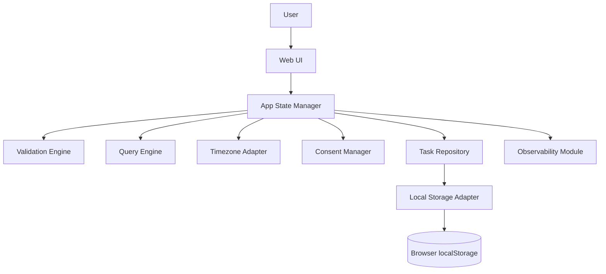

## 1. Overview
[Sources: BRD]

This technical specification defines the implementation approach for Release 1 (R1) of a web-based personal todo application for individual consumers. R1 is a greenfield implementation with local-device-only persistence, no authentication, and no remote storage of task content.

Primary goals:
- Deliver fast, low-friction task management (create/edit/delete/complete).
- Preserve privacy expectations by keeping task data local to browser/device.
- Meet defined performance, reliability, accessibility, and security non-functional requirements.

Input references used:
- `artifacts/brd.md`
- `artifacts/architecture.md`
- `artifacts/tech-stack.md`
- `assets/IDEA.md` (supplementary)

Target audience:
- Frontend engineers
- QA engineers
- DevOps/release engineers
- Product/architecture reviewers

Current state:
- No production implementation exists for this feature set (greenfield).

Desired end state:
- Production-ready web app deployed via static hosting, with local persistence, validated core flows, monitoring, and rollout controls.

## 2. Scope
[Sources: BRD, SiteMap(proxy from BRD journeys)]

### 2.1 In Scope
- Web app for individual users.
- Task CRUD with fields: title (required), due date (optional), priority, tags.
- Task status transitions: active ↔ completed.
- Filtering by status and tags; sorting by due date/priority.
- Local persistence via browser storage.
- Privacy notice and consent-version record (local).
- Accessibility and validation for core flows.

### 2.2 Out of Scope
- User accounts/login.
- Cloud sync across devices.
- Notifications/reminders.
- Team collaboration/shared lists.
- Native mobile apps.
- Attachments/subtasks/recurrence.

### 2.3 Assumptions
- BRD journeys serve as SiteMap proxy for impacted user surfaces.
- Single locale language is acceptable for R1 (English-only baseline).
- No external API contracts are required for task operations in R1.
- Azure static hosting pattern from tech stack recommendation is used.

## 3. Technical Design
[Sources: HLD, SiteMap(proxy from BRD journeys)]

### 3.1 Component Breakdown
1. **Web UI Layer**
   - Responsibility: Render task list/forms/filters; capture user actions; display validation/errors.
   - Does not: directly mutate persistent storage.

2. **App State Manager (Client Domain Orchestrator)**
   - Responsibility: command handling for create/edit/delete/toggle/filter/sort; coordinate validation, persistence, projections.
   - Does not: directly use browser APIs.

3. **Validation Engine**
   - Responsibility: enforce domain rules (required title, tag normalization, field constraints).
   - Does not: perform persistence.

4. **Task Repository**
   - Responsibility: abstract task/consent read-write operations.
   - Does not: business decision logic.

5. **Local Storage Adapter**
   - Responsibility: serialize/deserialize data envelopes; interact with browser localStorage safely.
   - Does not: run domain rules.

6. **Query/Projection Engine**
   - Responsibility: derive filtered/sorted/tag views deterministically.
   - Does not: persist data.

7. **Timezone Adapter**
   - Responsibility: UTC internal timestamp handling and local timezone rendering.

8. **Consent Manager**
   - Responsibility: first-run privacy notice gate; persist consent-version metadata locally.

9. **Observability Module**
   - Responsibility: emit non-sensitive telemetry/events and client errors.

### 3.2 Component Interaction Diagram


### 3.3 Data Flow (Critical Journeys)
1. **Create Task**
   - UI submit → App State Manager command → Validation Engine pass/fail.
   - On pass: repository write → localStorage ack → in-memory commit → projection refresh → UI update.

2. **App Reload / Hydration**
   - UI init → repository load → adapter parse envelope.
   - On success: in-memory state hydrated.
   - On corruption/failure: graceful degraded mode + warning.

3. **Filter/Sort/Tag**
   - UI criteria change → projection engine computes deterministic result.
   - Dates rendered via timezone adapter.

4. **Consent Flow**
   - App init → consent check.
   - If missing/outdated notice version: blocking notice shown.
   - Ack write required before normal task operations.

## 4. Low-Level Design (Generated)
[Sources: HLD → generated by agent; validated against BRD, Dependency Map(proxy), API Contracts(none for R1)]

### 4.1 Component Internals

#### 4.1.1 Web UI Layer
- Modules:
  - `TaskFormView`
  - `TaskListView`
  - `TaskItemView`
  - `FilterSortBar`
  - `PrivacyNoticeModal`
  - `ErrorBanner`
- Key interfaces:
  - `onCreateTask(input: CreateTaskInput): Promise<void>`
  - `onEditTask(id: TaskId, patch: UpdateTaskInput): Promise<void>`
  - `onDeleteTask(id: TaskId, confirmToken: string): Promise<void>`
  - `onToggleTask(id: TaskId, status: TaskStatus): Promise<void>`
  - `onApplyView(criteria: ViewCriteria): void`

#### 4.1.2 App State Manager
- Internal modules:
  - `CommandBus`
  - `StateStore`
  - `MutationCoordinator`
  - `HydrationCoordinator`
  - `ErrorMapper`
- Method signatures:
  - `initializeApp(): Promise<InitResult>`
  - `createTask(cmd: CreateTaskCommand): Promise<Result<Task, DomainError>>`
  - `editTask(cmd: EditTaskCommand): Promise<Result<Task, DomainError>>`
  - `deleteTask(cmd: DeleteTaskCommand): Promise<Result<void, DomainError>>`
  - `toggleTask(cmd: ToggleTaskCommand): Promise<Result<Task, DomainError>>`
  - `applyView(criteria: ViewCriteria): TaskView[]`
- Exceptions/errors:
  - `ValidationError`
  - `PersistenceError`
  - `StorageUnavailableError`
  - `CorruptDataError`

#### 4.1.3 Validation Engine
- Rules:
  - Title required, trimmed length 1..200.
  - Tags normalized lowercase, max 20/task, each 1..30 chars.
  - Due date parseable ISO datetime or null.
  - Priority in enum.
- Interface:
  - `validateCreate(input: CreateTaskInput): ValidationResult`
  - `validateEdit(existing: Task, patch: UpdateTaskInput): ValidationResult`

#### 4.1.4 Task Repository
- Interface:
  - `loadAllTasks(): Promise<Result<Task[], RepoError>>`
  - `saveAllTasks(tasks: Task[]): Promise<Result<void, RepoError>>`
  - `loadConsent(): Promise<Result<ConsentRecord | null, RepoError>>`
  - `saveConsent(record: ConsentRecord): Promise<Result<void, RepoError>>`

#### 4.1.5 Local Storage Adapter
- Local keys:
  - `todo.tasks.v1`
  - `todo.consent.v1`
- Envelope schema versioning:
  - `version: 1`
  - `updatedAtUtc: string`
  - `payload: ...`
- Methods:
  - `readEnvelope<T>(key: string): Result<Envelope<T> | null, StorageError>`
  - `writeEnvelope<T>(key: string, env: Envelope<T>): Result<void, StorageError>`

#### 4.1.6 Query/Projection Engine
- Methods:
  - `project(tasks: Task[], criteria: ViewCriteria): TaskView[]`
  - deterministic sort tie-breaker: `updatedAtUtc DESC`, then `id ASC`.

#### 4.1.7 Timezone Adapter
- Methods:
  - `toUtc(inputLocal: string): string`
  - `formatLocal(utcIso: string, locale: string, tz?: string): string`

#### 4.1.8 Consent Manager
- Methods:
  - `isNoticeAcknowledged(currentVersion: string): Promise<boolean>`
  - `acknowledge(version: string, atUtc: string): Promise<Result<void, ConsentError>>`

#### 4.1.9 Observability Module
- Methods:
  - `track(event: TelemetryEvent): void`
  - `captureError(error: AppError, context: ErrorContext): void`

### 4.2 Data Structures & Schema

#### 4.2.1 Data Models
```ts
type TaskId = string; // UUID v4

enum TaskStatus { ACTIVE = "active", COMPLETED = "completed" }
enum Priority { LOW = "low", MEDIUM = "medium", HIGH = "high" }

interface Task {
  id: TaskId; // required, unique
  title: string; // required, trimmed, 1..200
  dueDateUtc: string | null; // ISO-8601 UTC, nullable
  priority: Priority; // required
  tags: string[]; // normalized lowercase, unique within task
  status: TaskStatus; // required
  createdAtUtc: string; // required
  updatedAtUtc: string; // required
  version: number; // optimistic local version, >=1
}

interface ConsentRecord {
  noticeVersion: string; // required
  acknowledgedAtUtc: string; // required
}

interface TaskEnvelopeV1 {
  version: 1;
  updatedAtUtc: string;
  payload: Task[];
}

interface ConsentEnvelopeV1 {
  version: 1;
  updatedAtUtc: string;
  payload: ConsentRecord;
}
```
Constraints:
- `Task.id` unique.
- `tags` unique set per task.
- max tasks soft limit: 10,000 (UI warning beyond 1,000 for perf monitoring).

#### 4.2.2 Database Schema Changes
- No server database in R1.
- Logical “schema” defined by versioned local storage envelopes.

#### 4.2.3 Migration Scripts
- Migration utility from envelope v0 (if any legacy plain array) to v1.
- Pseudocode:
```text
if key(todo.tasks.v1) exists -> load as v1
else if key(todo.tasks) exists -> parse legacy array -> validate -> wrap v1 -> write todo.tasks.v1
on parse fail -> quarantine legacy key as todo.tasks.corrupt.<timestamp>
```

#### 4.2.4 DTOs (internal service boundaries)
```ts
interface CreateTaskInput {
  title: string;
  dueDateLocal?: string | null;
  priority?: Priority;
  tags?: string[];
}

interface UpdateTaskInput {
  title?: string;
  dueDateLocal?: string | null;
  priority?: Priority;
  tags?: string[];
  expectedVersion: number;
}

interface ViewCriteria {
  status: "all" | "active" | "completed";
  tag?: string;
  sortBy: "dueDate" | "priority" | "updatedAt";
  sortOrder: "asc" | "desc";
}
```

#### 4.2.5 Caching Structures & Invalidation Strategy
- Cache: in-memory normalized state map keyed by `TaskId`.
- Strategy: cache-aside with write-through commit semantics.
- Invalidation:
  - on successful mutation: patch map + regenerate ordered projection.
  - on hydrate: full map replace.
  - on storage error: rollback to last durable snapshot.

#### 4.2.6 Data Lifecycle
- Creation: task created ACTIVE with UTC timestamps.
- Update: field patch, `updatedAtUtc` refreshed, `version++`.
- Delete: hard delete after explicit confirmation.
- Archive: none in R1.
- GDPR erasure: local-only; user clears/deletes tasks/browser data.

### 4.3 Algorithms & Business Logic

#### 4.3.1 Core Algorithms
1. **Deterministic filter-sort projection**
```text
input: tasks[], criteria
filtered = by status/tag
sorted = comparator(criteria.sortBy, criteria.sortOrder)
if tie -> updatedAtUtc DESC then id ASC
output sorted views
```
- Complexity: O(n log n)
- Edge cases: null due dates (placed last for ascending dueDate).

2. **Optimistic version check on edit/delete/toggle**
```text
if cmd.expectedVersion != task.version -> conflict error
else apply mutation and increment version
```
- Complexity: O(1)
- Prevents stale rapid-update overwrite anomalies.

3. **Tag normalization**
```text
for each tag: trim -> lowercase -> drop empty -> dedupe -> cap 20
```
- Complexity: O(k)

#### 4.3.2 State Machines
Task state:
- `ACTIVE -> COMPLETED` (toggle complete)
- `COMPLETED -> ACTIVE` (reactivate)
- Any state -> `DELETED` (terminal via confirmed delete)

Consent state:
- `UNKNOWN -> REQUIRED -> ACKNOWLEDGED(version)`
- If notice version changes: `ACKNOWLEDGED(old) -> REQUIRED`

#### 4.3.3 Validation Rules & Business Invariants
- Empty title invalid on create/edit.
- Delete requires explicit confirmation token.
- No remote task payload transmission in R1.
- UTC persistence invariant for timestamps.

#### 4.3.4 Calculation Formulas (worked examples)
- Priority rank map (for sorting): `high=3, medium=2, low=1`.
  - Example desc sort: `[high, medium, low]`.
- Latency SLO compliance check:
  - `p95(action_latency_ms) <= 200` and `p99 <= 400` under test load.

### 4.4 Concurrency & Consistency
- Concurrency model: single-client-thread with potential rapid sequential events.
- Control strategy: optimistic local version checks.
- Idempotency:
  - Command IDs for create/delete/toggle emitted client-side to avoid duplicate processing under double-click/debounced retries.
- Transaction boundary:
  - validate → persist envelope → commit in-memory state.
- Isolation level equivalent:
  - serial command processing queue in state manager.

## 5. API & Integration Definitions
[Sources: API Contracts(read-only reference none), Dependency Map(proxy)]

### 5.1 External Endpoints
- No external task APIs used in R1.
- Static asset delivery endpoints managed by hosting platform (non-domain APIs).

### 5.2 External Integrations
1. **Browser localStorage API**
   - Protocol: browser synchronous JS API.
   - Timeouts: N/A.
   - Retry policy: up to 2 retries for transient write/read failures where safe.
   - Circuit breaker: open after 3 consecutive storage failures; half-open probe each 60s.
   - Fallback: degraded in-memory-only session mode with persistent user warning.

2. **Optional telemetry endpoint (non-task-content)**
   - Protocol: HTTPS beacon/fetch.
   - Timeout: 2s.
   - Retry: best-effort 1 retry.
   - Fallback: drop event (non-blocking).

### 5.3 Internal Service Communication
- Entirely in-process module calls.
- Sync patterns for domain commands and projections.
- No async queue required for core flows.

### 5.4 End-to-End Data Flow
- Critical path `create task`:
  - UI event → command validation → storage write → state commit → projection render.
- Critical path `reload`:
  - init → storage read/parse → hydrate or degrade.

## 6. Error Handling & Resilience
[Sources: BRD, generated LLD]

### 6.1 Error Catalog
- Validation errors:
  - `TASK_TITLE_REQUIRED`
  - `TASK_TITLE_TOO_LONG`
  - `INVALID_DUE_DATE`
  - `INVALID_PRIORITY`
- Business errors:
  - `VERSION_CONFLICT`
  - `DELETE_CONFIRMATION_REQUIRED`
- Infrastructure/storage errors:
  - `STORAGE_UNAVAILABLE`
  - `STORAGE_QUOTA_EXCEEDED`
  - `CORRUPT_PERSISTED_DATA`
- Dependency errors:
  - `TELEMETRY_SEND_FAILED` (non-fatal)

Error response format (internal):
```ts
interface AppError {
  code: string;
  message: string;
  userMessage: string;
  recoverable: boolean;
  context?: Record<string, string | number | boolean>;
}
```

### 6.2 Resilience Patterns
- Retry: bounded retries for storage and telemetry.
- Fallback: in-memory-only mode when storage is unavailable.
- Fail-fast: block invalid commands before persistence.
- Compensating action: rollback in-memory state on persistence failure.

### 6.3 Graceful Degradation
- If persistence fails:
  - keep app usable for transient session operations.
  - show persistent banner about non-durable mode.
- If corrupted data:
  - quarantine bad payload key and continue with empty state after user acknowledgment.

### 6.4 Dead-Letter Queue & Poison-Message Strategy
- No message queue in R1.
- Equivalent poison handling: quarantine corrupt local payloads under `.corrupt.<timestamp>` keys for diagnostics.

## 7. Performance
[Sources: BRD NFRs, HLD]

### 7.1 Latency Budgets
Under up to 1,000 stored tasks:
- Initial render: p95 <= 1200ms.
- Mutation actions (create/edit/delete/toggle): p50 <= 100ms, p95 <= 200ms, p99 <= 400ms.
- Filter/sort apply: p95 <= 120ms.

### 7.2 Indexing Strategy
- In-memory indexes:
  - map by `id` for O(1) lookup.
  - derived grouping by status/tag computed per projection cycle.

### 7.3 Caching Strategy
- Cache target: hydrated task map and last projection.
- TTL: session lifetime.
- Eviction: full replace on hydrate; selective patch on writes.
- Consistency: write-through to localStorage before durable confirmation.

### 7.4 Bottleneck Mitigations
- Avoid repeated full parse by maintaining in-memory canonical state.
- Debounce rapid UI events for toggle/edit bursts.
- Use lightweight rendering and list virtualization if tasks exceed 1,000.

### 7.5 Load Testing Plan & Acceptance Criteria
- Scenario A: hydrate 1,000 tasks from storage.
- Scenario B: 100 rapid mixed mutations in 60s.
- Scenario C: repeated filter/sort/tag operations across full dataset.
- Pass criteria: meet section 7.1 SLOs; zero unrecoverable errors.

### 7.6 Pagination, Rate Limiting & Throttling
- Pagination: not required for <=1,000 tasks, but prepared for virtualized rendering.
- Client throttling: 250ms debounce on repeated toggle and filter changes.
- Rate limiting (server): N/A for domain actions.

## 8. Migration & Rollback Plan
[Sources: HLD, generated LLD, Dependency Map(proxy)]

### 8.1 Migration Phases
- **Phase 1 (Additive):** introduce v1 envelope schema + feature flags for new UI modules.
- **Phase 2 (Dual-read/write):** if legacy key exists, dual-read; write canonical v1.
- **Phase 3 (Cutover):** read exclusively from v1, keep legacy backup for one release window.

### 8.2 Rollback Procedures
- Phase 1 rollback:
  - disable feature flag for affected module.
  - revert to previous stable UI bundle.
- Phase 2 rollback:
  - stop migration writes.
  - continue reading legacy key.
- Phase 3 rollback:
  - re-enable legacy read path using preserved legacy snapshot key.

### 8.3 Data Migration Approach
- Online, client-side opportunistic migration during app init.
- Batch size: full local dataset (single envelope operation).
- Throttling: N/A (local operation); show non-blocking progress indicator for large data.
- Validation: record counts and checksum length parity checks post-conversion.

### 8.4 Rollback Decision Criteria
Trigger rollback if:
- storage write failure rate > 1% for 15 min.
- client crash rate > 2% sessions.
- p95 mutation latency > 300ms sustained 15 min.

### 8.5 In-Flight Request Handling During Cutover
- No network cutover for domain APIs.
- During local migration, command queue pauses writes briefly; reads remain available.

## 9. Dependencies & Prerequisites
[Sources: Dependency Map(proxy), API Contracts(none)]

### 9.1 Internal Service Dependencies
- UI depends on App State Manager interfaces.
- App State Manager depends on Validation/Repository/Projection/Timezone/Consent modules.

### 9.2 Infrastructure Dependencies
- Static hosting (Azure Static Web Apps recommended).
- TLS certificate and DNS.
- CI pipeline for lint/test/build/deploy.

### 9.3 External Approvals & Access Required
- Hosting subscription access.
- Domain management access.
- (If telemetry enabled) privacy/legal approval for event schema.

### 9.4 Implementation Sequencing
1. Domain models + validation engine.
2. Local storage adapter + repository.
3. App state manager command pipeline.
4. UI flows for CRUD + status toggle.
5. Query/projection + timezone handling.
6. Consent manager and privacy notice.
7. Observability + performance tuning.
8. Hardening tests + release automation.

### 9.5 Dependency Risks
- Browser storage behavior variability across environments.
- No remote backup increases user data-loss risk.
- Legal ambiguity on telemetry and privacy jurisdiction.

## 10. Acceptance Criteria & Testing Strategy
[Sources: BRD]

### 10.1 Technical Acceptance Criteria
Functional:
- Given valid input, task create/edit/delete/toggle operations persist and render correctly.
- Given invalid input, operation blocked with deterministic error.

Performance:
- SLO targets in section 7.1 pass in supported browsers.

Reliability:
- App recovers gracefully from storage corruption/unavailability without crash.

Security/Privacy:
- No task payload sent remotely.
- All user-entered fields sanitized before render.

### 10.2 Test Plan
- Unit tests:
  - validation engine, projection sorting rules, timezone conversions, version conflict logic.
- Integration tests:
  - state manager + repository + storage adapter end-to-end.
- E2E tests:
  - create/edit/delete/toggle/filter/sort/hydrate/consent flows.
- Performance tests:
  - dataset size 1,000 tasks benchmark suite.

### 10.3 Definition of Done
- Code reviewed and merged.
- Unit/integration/E2E suites passing.
- Accessibility checks for core routes pass WCAG 2.1 AA criteria.
- Monitoring dashboards and alerts configured.
- Runbook and user-facing privacy notice content finalized.

## 11. Open Questions & Decisions Needed
1. `[BRD §11/§14]` KPI baselines are TBD.
   - Options: beta baseline capture vs benchmark-based targets.
   - Recommendation: beta baseline capture before KPI lock.

2. `[BRD §14]` Browser support matrix not explicitly finalized.
   - Options: latest 2 versions major browsers vs narrower support.
   - Recommendation: latest 2 versions of Chrome/Firefox/Safari/Edge.

3. `[BRD §7/§14]` Legal/compliance scope (GDPR/CCPA applicability) unresolved.
   - Options: formal legal screening now vs defer.
   - Recommendation: formal screening pre-launch.

4. `[Tech Stack]` Telemetry platform selection unresolved.
   - Options: App Insights vs privacy-first third-party.
   - Recommendation: App Insights with strict no-task-content policy.

5. `[BRD US-007]` Sorting behavior for null due dates needs final product decision.
   - Options: nulls-last always vs nulls-first descending.
   - Recommendation: nulls-last for both asc/desc for predictability.

## 12. Appendix
Input document index (relative paths):
- `artifacts/brd.md`
- `artifacts/architecture.md`
- `artifacts/tech-stack.md`
- `assets/IDEA.md`

Document notes:
- Pre-existing architecture/HLD-like material used as primary topology source.
- No separate API contract files were found for R1 domain operations.
- No user-provided pre-existing LLD was supplied.
